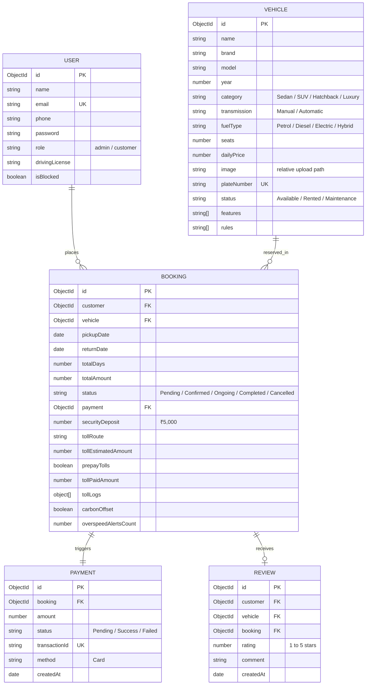

# Bharath Rental System — Car Rental Administration System

Bharath Rental System is a fully functional, premium, web-based Car Rental Administration System customized for the Indian market, designed as an academic college/university-level semester project. The system handles user roles (Administrator and Customer), reservation calendar overlaps, mock credit-card checkouts, client-side PDF invoice downloads, review submissions, and administrative reports with CSV exports.

---

## 📖 Project Overview & Objectives

The primary objective of the Bharath Rental System is to automate and streamline the vehicle rental lifecycle with localized presets:
1. **Customer Side**: Registration, profile/driving license management, catalog browsing with **Brand-Model Cascading Filters**, Indian budget-to-premium fleet options, date range availability filtering, mock card checkout, invoice downloading, and vehicle review writing.
2. **Admin Side**: Fleet CRUD management, reservation state transitions, client access blocking, analytical KPIs, and CSV data reports.
3. **Unique Indianized Academic Features**:
   - **AI FASTag & Toll Auto-Estimator**: Suggests routes (e.g. Mumbai-Pune Expressway: ₹320) and allows pre-paying tolls.
   - **FASTag Toll Gate Crossing Simulator**: An interactive widget on the user's dashboard to simulate gate crossings and log deductions.
   - **SafarLock Speed Warning Alerts**: Simulates speed limit monitoring (80 km/h in city, 120 km/h on expressways) and alerts admins of violations.
   - **GreenYatra Carbon Offset & Impact Tracker**: Tracks environmental contributions (₹45 offset tree-plantation fee) per trip.
   - **Bharath Yatra Itinerary Planner**: Auto-recommends dhabas, pitstops, and sightseeings based on chosen toll routes.

---

## 🛠️ Technology Stack & Rationale

- **Frontend**: React (Vite) + Tailwind CSS (v3)
  - *React* handles fast, modular component rendering.
  - *Tailwind CSS* provides sleek styling, grid designs, and glassmorphic micro-animations.
  - *Recharts* is used for administrative monthly income graphs.
  - *jsPDF* generates professional PDF invoices client-side.
- **Backend**: Node.js + Express.js
  - Scalable and modular REST API handling database records.
- **Database**: MongoDB + Mongoose
  - Document-based database for flexible relationship linkages and search queries.
- **Authentication**: JWT-based session tokens with bcrypt password hashing.
- **Mock Notifications**: Emails are logged to the console and saved in `server/logs/emails.json` to facilitate offline vivas.

---

## 📊 Entity Relationship (ER) Diagram



---

## 🚀 Installation & Setup Instructions

### Prerequisites
- [Node.js](https://nodejs.org/) installed (v16+ recommended).
- [MongoDB Community Server](https://www.mongodb.com/try/download/community) installed and running locally.

### Step 1: Navigate to Project Directory
```bash
cd car-rental-admin-system
```

### Step 2: Configure Server `.env` File
Create a `.env` file under `/server` folder:
```text
PORT=5000
MONGO_URI=mongodb://127.0.0.1:27017/car_rental_db
JWT_SECRET=supersecretkeyforcarrentalproject
NODE_ENV=development
```

### Step 3: Install Dependencies
```bash
# Install Server packages
cd server
npm install

# Install Client packages
cd ../client
npm install
```

### Step 4: Seed Database Demo Data
Seed the database with Indian vehicles, admin accounts, customer profiles, and booking history:
```bash
cd ../server
npm run seed
```

### Step 5: Start Development Servers
Run the servers concurrently to start local hosting:
```bash
# Start Backend API (runs on http://localhost:5000)
cd server
npm run dev

# Start Frontend App (runs on http://localhost:5173 or similar Vite default)
cd ../client
npm run dev
```

---

## 🔑 Demo Login Credentials

You can use the seeded credentials to demonstrate both roles instantly:

| Role | Email Address | Password | Purpose / Features |
| :--- | :--- | :--- | :--- |
| **Customer** | `customer@carrental.com` | `customer123` | Browse catalog, select brand/models, pre-pay tolls, simulation gates, and overspeed warning dashboards |
| **Admin** | `admin@carrental.com` | `admin123` | View dashboard charts, monitor overspeeding alerts, CRUD vehicles, update bookings status, block users, export CSV |

---

## 📸 Unique Academic Features & Viva Points
1. **Interactive FASTag Toll Gate Crossings**: Customers can click to trigger a mock toll gate crossing on their booking dashboard. The dashboard updates FASTag balances and creates logs dynamically.
2. **SafarLock Geofence Violations**: Demonstrates simulated speeding (speeding past 120 km/h). An emergency flashing alert is displayed, and the administrator receives real-time overspeed violation alerts linked to the customer's billing.
3. **GreenYatra Carbon Offset**: Allows eco-friendly users to offset 42 kg of CO₂ emissions for ₹45. Keeps a track of the total offset contribution.
4. **Cascading Dropdowns**: Simplifies the vehicle search by filtering models according to selected brands.
